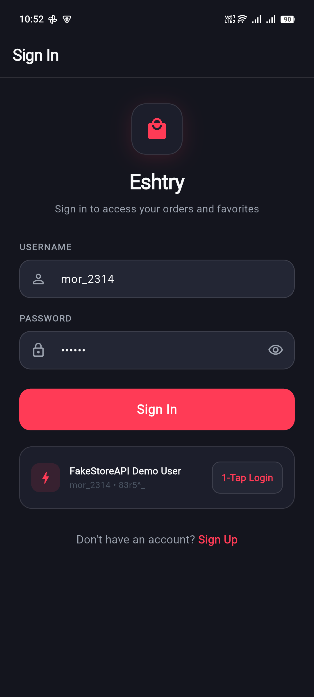
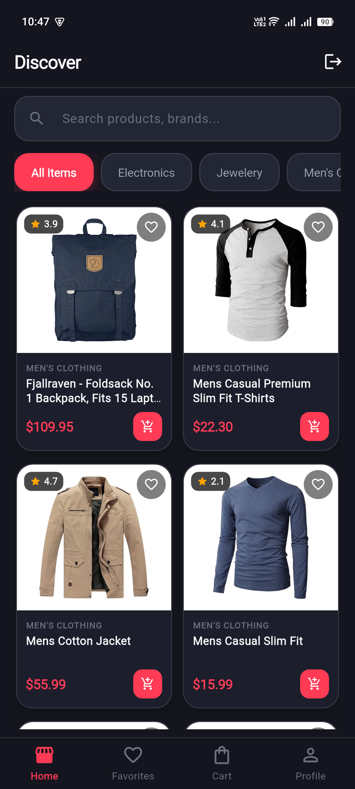
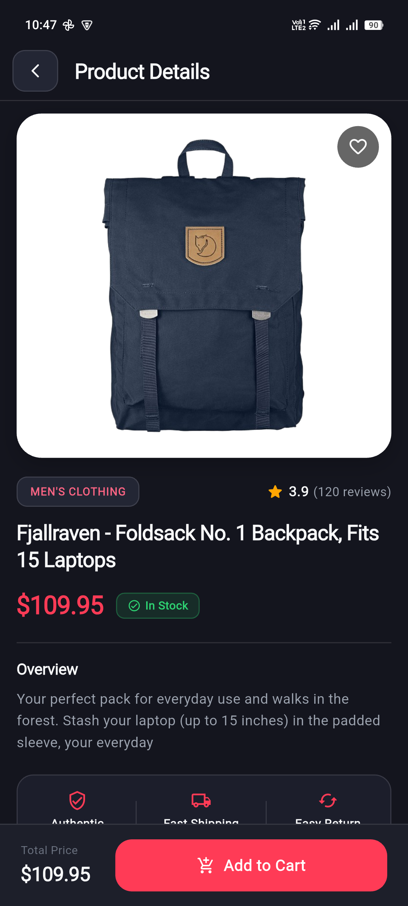
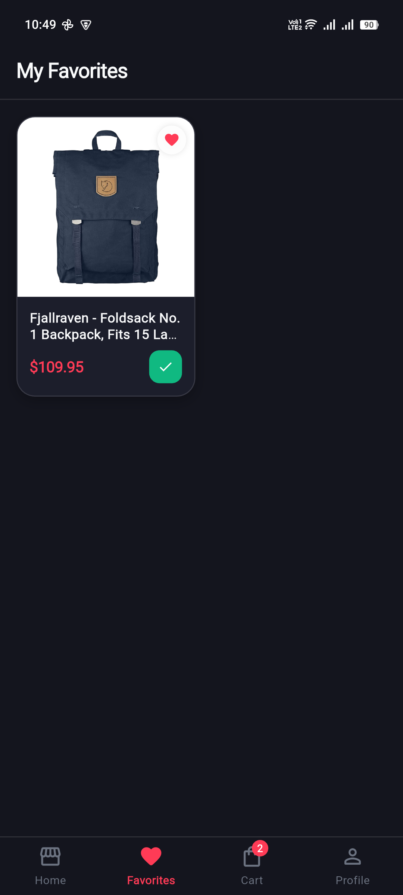
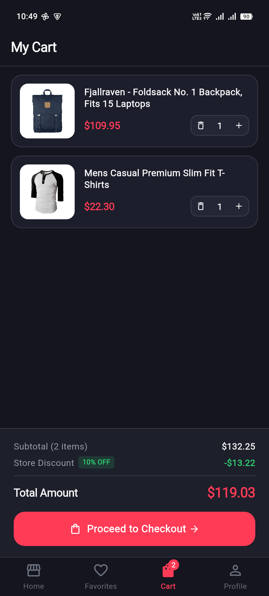
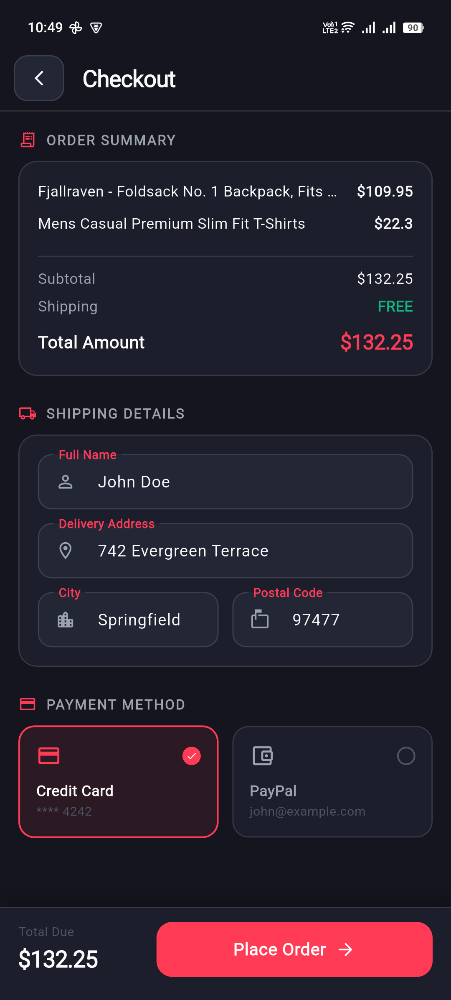
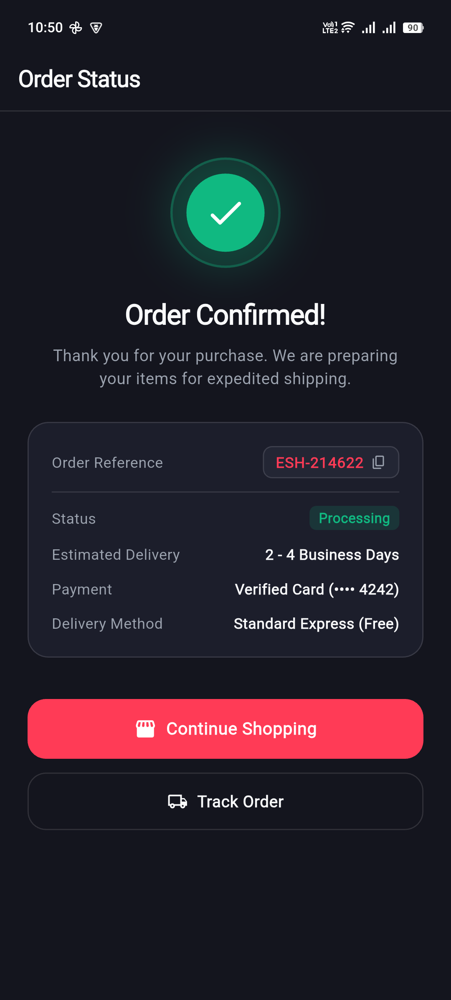
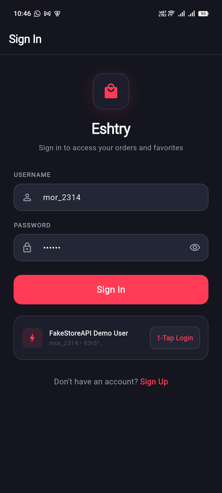
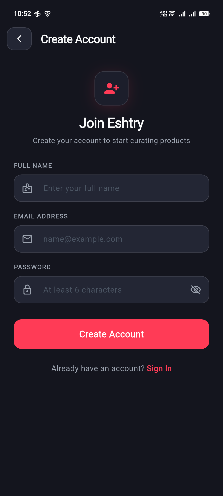

# Eshtry-menny 🛒

Eshtry-menny is a modern, high-end Flutter e-commerce application engineered with clean architecture, robust resilience mechanisms, and a dark luxury editorial design system. The app features comprehensive product browsing, category filtering, cart management with SQLite persistence, wishlists, order history tracking, and user authentication.

## 📱 Screens

<p align="center">
  
  
  
</p>
<p align="center">
  
  
  
</p>
<p align="center">
  
  
  
</p>

## ✨ Features

### 🎨 Editorial Dark Luxury UI/UX
- **Obsidian Dark Palette**: Deep background (`#14151E`), slate surfaces (`#1D1F2A`), and card surfaces (`#1C1E2B`) with subtle 12% white borders (`0x1FFFFFFF`) for visual depth.
- **Coral-Crimson Accent**: Refined interactive accent (`#FF3B56`) reserved for primary CTAs, active states, and live cart badges.
- **Tactile Haptic Feedback**: Light and medium haptics on item addition, quantity changes, favorite toggles, and order placement.
- **Responsive Layout**: Fluid layouts across phone and tablet screens.

### 🔐 Authentication
- User sign-up and sign-in integrated with [FakeStore API](https://fakestoreapi.com/)
- State-managed authentication flow using BLoC/Cubit
- **1-Tap Demo Login**: Pre-filled test credentials card for quick review

### 🏪 Product Discovery & Details
- Browse full catalog with in-memory category filtering
- Real-time search with clear actions and empty state illustration
- High-contrast squircle product cards with star ratings and instant cart action
- Rich Product Detail Screen with 38% hero view, quality guarantee badges, and sticky purchase drawer

### 🛍️ Cart, Wishlist & Checkout
- **Cart Management**: Add/remove items, stepper controls (`-`, qty, `+`), and swipe-to-delete with red trash background
- **Local Persistence**: Both shopping cart and favorites saved in SQLite via `sqflite`
- **Bottom Nav Cart Badge**: Dynamically displays real-time cart item count across all screens
- **Checkout Flow**: Interactive payment method selection (Credit Card & PayPal), shipping address fields, and order summary
- **Celebratory Order Status**: Animated checkmark, simulated order ID (`#ESH-...`) with 1-tap clipboard copy, and receipt breakdown

### 👤 Member Profile & Order History
- Verified Member card with gradient initials avatar and contact details
- Shipping location address card
- Order History timeline cards with item counts, dates, and `Delivered` status chips
- Secure account sign-out dialog

## 🏗️ Architecture & Engineering

The codebase adheres to **Clean Architecture** principles and domain-driven design:

```
lib/
├── core/
│   ├── constants/       # App colors, design tokens, and theme constants
│   ├── navigation_cubit # Top-level tab and authentication routing cubit
│   ├── network/         # ApiClient with retry, jitter, timeout, & typed exceptions
│   ├── services/        # Local SQLite database helper
│   ├── theme/           # Global dark theme configuration
│   └── widgets/         # CustomAppBar, BottomNavBar, and shared components
├── features/
│   ├── auth/            # AuthCubit, AuthRepository, SignIn & SignUp screens
│   ├── cart/            # CartCubit, CartScreen, CheckoutScreen, OrderSuccessScreen
│   ├── favorites/       # FavoritesCubit, FavoritesScreen, EmptyFavorites
│   ├── home/            # ProductCubit, ProductRepository, Home & ProductDetail
│   └── profile/         # ProfileCubit, ProfileRepository, ProfileScreen
└── main.dart            # Application entry point & dependency injection
```

### 🛡️ Network Resilience & Error Handling
- **`ApiClient`**: Centralized HTTP client with exponential backoff and random jitter for 5xx errors and transient connection failures.
- **Fail-Fast Policy**: 4xx client errors (such as 401 Unauthorized) fail immediately without wasteful retries.
- **Typed Exceptions**: Clean domain exceptions (`NetworkException`, `AuthException`, `ServerException`, `ClientException`) with friendly user-facing messages.
- **`NetworkMonitorCubit`**: Real-time connectivity monitoring.

## 🚀 Getting Started

### Prerequisites
- Flutter SDK (3.24.0+ recommended)
- Dart SDK (3.5.0+)
- Android Studio / VS Code
- Android / iOS emulator or physical device

### Installation

1. **Clone the repository**
   ```bash
   git clone https://github.com/AhmedGamalFarouk/Eshtry-menny.git
   cd Eshtry-menny
   ```

2. **Install dependencies**
   ```bash
   flutter pub get
   ```

3. **Run the app**
   ```bash
   flutter run
   ```

### Demo Credentials
For testing and reviewing the application:
- **Username:** `mor_2314`
- **Password:** `83r5^_`
*(or tap the "1-Tap Login" button on the Sign In screen)*

## 🧪 Automated Testing

The project includes a comprehensive suite of 20 unit and widget tests covering models, repositories, network retry logic, cubits, and screen smoke tests.

Run the test suite:
```bash
flutter test
```

Run static analysis:
```bash
flutter analyze
```

## 📦 Key Dependencies

- **`flutter_bloc`**: State management & unidirectional data flow
- **`http`**: API networking client
- **`sqflite` & `path`**: SQLite local persistence for cart and favorites
- **`cached_network_image`**: Asynchronous image caching with placeholder spinners
- **`sizer`**: Responsive device screen adaptation
- **`equatable`**: Value equality for BLoC states
- **`shared_preferences`**: Session token persistence

## 📄 License

This project is licensed under the MIT License - see the [LICENSE](LICENSE) file for details.

---

**Built with ❤️ using Flutter**

